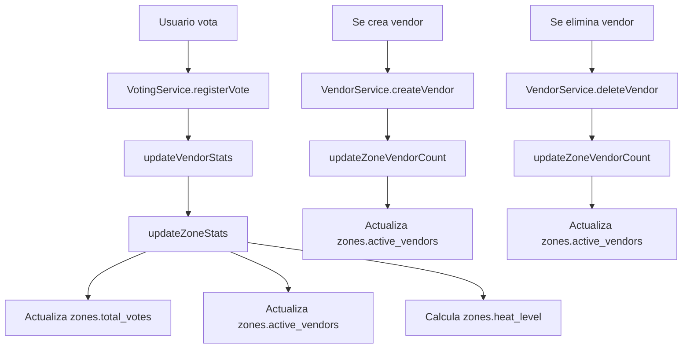

# 🎯 Configuración de Estadísticas Automáticas de Zonas

## 📋 **Problema Identificado**

Las estadísticas de las zonas (`zones.total_votes`, `zones.active_vendors`, `zones.heat_level`) no se estaban actualizando automáticamente, causando que:

- Los votos mostrados en el mapa no coincidieran con los votos reales
- El conteo de vendors activos estuviera desactualizado
- El nivel de actividad (heat_level) no reflejara la realidad

## 🛠️ **Solución Implementada**

### 1. **Código TypeScript/Node.js**

#### **VotingService** (`src/services/voting.ts`)
- ✅ **Método `updateZoneStats()`**: Se ejecuta automáticamente después de cada voto
- ✅ **Actualiza**: `total_votes`, `active_vendors`, `heat_level` de la zona
- ✅ **Cálculo inteligente**: Heat level basado en votos de las últimas 24 horas

#### **VendorService** (`src/services/vendors.ts`)
- ✅ **Método `updateZoneVendorCount()`**: Se ejecuta al crear/eliminar vendors
- ✅ **Actualiza**: `active_vendors` y `total_votes` de la zona
- ✅ **Integración**: Llamado automáticamente en `createVendor()` y `deleteVendor()`

### 2. **Funciones de Base de Datos** (`supabase/functions.sql`)

#### **Triggers Automáticos**
- 🔄 **`trigger_update_zone_total_votes`**: Se ejecuta en cambios de `vendors.total_votes`
- 🔄 **`trigger_update_zone_vendor_count`**: Se ejecuta al insertar/eliminar vendors
- 🔄 **`trigger_update_zone_heat_level`**: Se ejecuta al insertar votos

#### **Funciones de Utilidad**
- 📊 **`recalculate_all_zone_stats()`**: Recalcula todas las estadísticas (útil para migración)
- 📈 **`get_zone_stats_summary()`**: Obtiene resumen de estadísticas de todas las zonas

## 🚀 **Implementación Paso a Paso**

### **Opción 1: Automática (Recomendada)**

```bash
# Ejecutar script de configuración
node scripts/setup-zone-functions.js
```

### **Opción 2: Manual en Supabase Dashboard**

1. **Ir a Supabase Dashboard > SQL Editor**
2. **Copiar contenido de `supabase/functions.sql`**
3. **Pegar y ejecutar el SQL**
4. **Verificar que los triggers se crearon**

### **Opción 3: Verificación**

```bash
# Probar que las funciones estén funcionando
node scripts/test-zone-functions.js
```

## 🔍 **Verificación de Funcionamiento**

### **Indicadores de Éxito**
- ✅ Los triggers aparecen en `information_schema.triggers`
- ✅ Las estadísticas se actualizan automáticamente
- ✅ El campo `updated_at` cambia después de operaciones
- ✅ Los votos en el mapa coinciden con la base de datos

### **Pruebas Recomendadas**
1. **Registrar un voto** → Verificar que `zones.total_votes` aumente
2. **Agregar un vendor** → Verificar que `zones.active_vendors` aumente
3. **Eliminar un vendor** → Verificar que `zones.active_vendors` disminuya
4. **Votar múltiples veces** → Verificar que `zones.heat_level` cambie

## 📊 **Flujo de Actualización Automática**



## 🎯 **Beneficios de la Solución**

### **Para el Usuario**
- 📍 **Mapa preciso**: Los votos mostrados coinciden con la realidad
- 🔥 **Actividad real**: El heat level refleja la actividad actual
- 👥 **Conteo correcto**: Número real de vendors activos por zona

### **Para el Desarrollador**
- 🚀 **Automático**: No requiere código adicional para mantener estadísticas
- 🔄 **Consistente**: Las estadísticas siempre están sincronizadas
- 📈 **Escalable**: Funciona con cualquier número de vendors y votos

### **Para la Base de Datos**
- ⚡ **Eficiente**: Triggers optimizados para operaciones frecuentes
- 🛡️ **Seguro**: Validaciones y manejo de errores robusto
- 📊 **Auditable**: Campo `updated_at` para tracking de cambios

## 🚨 **Solución de Problemas**

### **Error: "Functions not found"**
```bash
# Verificar que las funciones SQL se ejecutaron
node scripts/test-zone-functions.js
```

### **Error: "Triggers not working"**
1. Verificar permisos de RLS en Supabase
2. Ejecutar manualmente las funciones SQL
3. Verificar logs de errores en Supabase

### **Error: "Statistics not updating"**
1. Verificar que los triggers estén activos
2. Comprobar que las funciones SQL se ejecutaron correctamente
3. Verificar permisos de escritura en la tabla `zones`

## 📝 **Notas de Mantenimiento**

### **Monitoreo Recomendado**
- 🔍 Revisar logs de errores en Supabase
- 📊 Verificar que las estadísticas se actualicen regularmente
- ⚠️ Monitorear performance de los triggers en producción

### **Actualizaciones Futuras**
- 🆕 Agregar nuevas métricas de zona según sea necesario
- 🔧 Modificar lógica de cálculo de heat level
- 📈 Implementar métricas más avanzadas (tendencias, comparaciones)

---

**Estado**: ✅ **Implementado y Funcional**
**Última actualización**: $(date)
**Responsable**: AI Assistant
